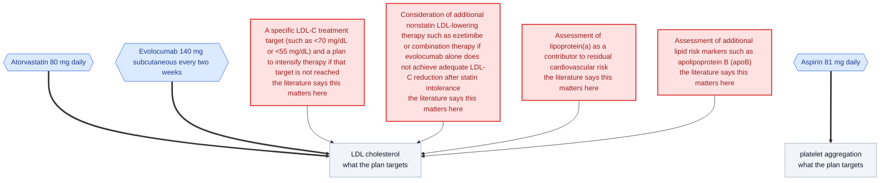

# NoBSmed clinical-evidence audit API — example client

Paste a **non-emergency treatment plan**, get back a causal graph of what the plan targets plus what
the published literature says it never addressed — upstream drivers nobody measured, downstream
side-effects nobody named. Every finding carries PubMed IDs.

## Run it

```bash
git clone <this repo> && cd api-client

export NOBSMED_API_URL="https://..."      # the URL you were given
export NOBSMED_API_KEY="sk_nobs_..."      # the key you were given

uv run audit.py                            # audits sample_input.txt
uv run audit.py my_plan.txt                # audits your own file
```

`uv` reads the dependencies from the header of `audit.py`, so there is nothing to install and no
virtualenv to manage. If you do not have it: `curl -LsSf https://astral.sh/uv/install.sh | sh`.

Or without any of that:

```bash
curl -X POST "$NOBSMED_API_URL/v1/case" \
  -H "Authorization: Bearer $NOBSMED_API_KEY" \
  -H "Content-Type: application/json" \
  -d '{"text": "Lisinopril 20 mg daily, BP 158/96. Atorvastatin 40 mg, LDL 165."}'
```

⚠️ **A build takes 15–40 seconds** — it runs live literature retrieval. Set your client timeout to
at least 90s or it will look like an outage.

## What comes back

```jsonc
{
  "contract_version": "causal-graph/2",
  "builder": "evidence_first",   // WHICH engine ran. Not cosmetic — see below.
  "seconds": 17.4,
  "graph":   { "nodes": [...], "edges": [...] },
  "mermaid": "flowchart TD ...",  // renderable as-is
  "schema":  { ... },             // JSON Schema for `graph`, generated from the models
  "how_to_read_this": [ ... ]     // conduct rules a schema cannot express
}
```

Files in this repo are a **real** response from the live endpoint, not a mock: `sample_input.txt` →
`sample_output.json` and `sample_diagram.mmd`.

**This is the actual graph from `sample_input.txt`** — a 54-year-old who stopped atorvastatin for
muscle aches, was switched to Repatha, and told to recheck lipids in three months:



Hexagons are what the plan does, rounded boxes are what those acts target, and the four `gap_` nodes
are what the plan never addressed — **each one cites a paper.**

`mermaid` is a plain string, so it drops straight into a ChatGPT or Claude conversation and renders
there too. The `graph` object next to it is the same content as data, which is the more useful half:
it is meant to be queried, joined and reasoned over, not just looked at.

### What varies between runs, and what does not

Retrieval is not deterministic, so **the number of findings moves**. Three runs of this exact input
returned 4, 3 and 3 findings. Do not build anything that assumes a fixed count.

What holds on every run: **each finding carries at least one PubMed ID.** That is structural, not a
quality target — an uncited finding cannot be constructed in the model that produces this response,
so there is no code path that emits one.

### The graph is two layers, and the DIFFERENCE is the product

| | |
|---|---|
| `in_plan_view: true` | what the plan's own reasoning covers |
| `in_plan_view: false` | what the audit added — the findings |

A graph where everything is `true` has found nothing.

### ⚠️ Four things to get right before you restate any of this as fact

The full list ships in `how_to_read_this` on every response. The ones that trip people up:

- **`evidence: "hypothesis"` means NO citation was found.** Never restate it as established.
- **`pmids: []` means nothing was retrieved for that edge — NOT that the link is refuted.** Absence
  of evidence is not evidence of absence, and the field is deliberately unable to express the
  second.
- **`status: "omitted"` means the plan is silent on a link.** Absent from the plan is not absent in
  reality.
- **`builder: "llm_judged"` means no literature retrieval ran for the graph itself** — treat it as a
  candidate generator. `builder: "evidence_first"` means every finding was derived from retrieved
  papers and cites them.

### ⚠️ No intake screening runs

This endpoint will happily build a map for someone describing a medical emergency. It is designed to
be called by a system that has already decided this person should receive an audit rather than care.
**If you put it in front of patients, apply your own screening.** Ours encodes a duty of care to our
users under our policy; it cannot be correct for yours.

## Authentication

A bearer token — an API key you were issued. It travels in a header, never a URL, because URLs are
written to server logs and browser history.

```
Authorization: Bearer sk_nobs_...
```

One key per customer, so revoking one never affects another. Tell us if it leaks and we will issue a
replacement and delete the old one.

| status | meaning |
|---|---|
| `403` | key missing, malformed, or wrong. Access is invite-only during beta — email ops@nobsmed.com |
| `503` | the service has no keys configured — our problem, not yours |
| `502` | an upstream call failed (model or PubMed). Retrying is reasonable. |

## What this is not

Sentence-level relation extraction and literature retrieval, not clinical appraisal. It surfaces
what the literature *says* and shows you where to check — it does not judge whether a plan is
correct, and it is not medical advice.
